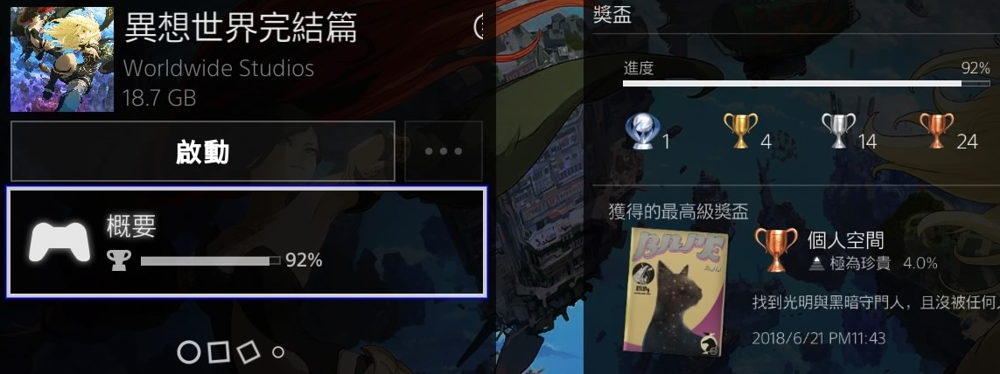
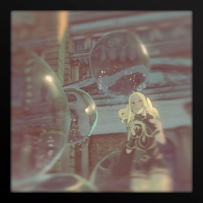
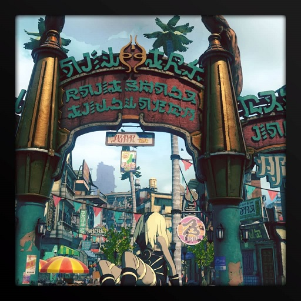
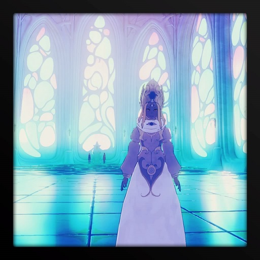
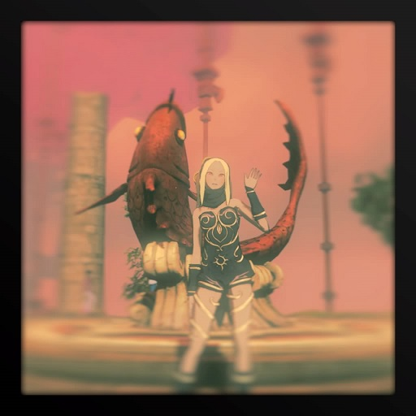

# About Gravity Rush

*纪念自己PS4上第一款运行的游戏以及第一款白金的游戏——重力异想世界*

## 简单来说

在没有任何推荐下喜欢上一款游戏大概是这样的一个过程：优秀的画面挑起兴趣，特别的玩法作为支撑，精彩的故事让人回味。这也是我认识这款游戏的过程。

## 正式开始

### 特别的风格

这款游戏最开始吸引我的地方应该是画面。这种画风对于并未接触太多日厂游戏的我而言是特别的。它并没有整个都是卡通风格，也没有类似“厚涂”的风格，更像是真实和非真实的混搭。再加上蓝天白云，有序而繁华的街景让这款游戏在我脑中萦绕。

说实话，画面近看并不算是特别精致，模型依然能够看到棱角，人物表情有时会显得很僵硬。但从整体上看，却有种很清新的感觉。当然，这是针对第二代而言的。从预告片以及游戏的封面可以看到，这次的游戏环境整体的色彩要更加丰富。

第二部的初始场景是一座天空城——泽加帕拉劳 。蓝天白云作为背景，市集上的摊位，行人的衣着颜色都十分丰富，再配上明亮的阳光，整个画面非常的鲜艳，给人一种很活泼的感觉，同时又有几分舒适与安逸。天空城的建筑风格有点偏向东南亚的建筑类型，再配合到处都能见到的高耸的椰子树，市井气息以及度假的感觉扑面而来。

另外一点是，游戏只对其中的人物，包括主角和NPC使用了动画渲染，包括描边以及衣服上的阴影处理。但对于周围场景，则使用了偏真实的渲染方式。当然，在对物体的阴影处理上并没有完全按照真实性渲染那样，阴影部分颜色一致同时边缘进行了模糊。

游戏特效上，抓取，投掷物体时候的扭曲效果；飞行以及摄像机移动时候的动态模糊使得整个画面的过渡自然。在快速飞行时候，人物身边的由细变粗的白线，这种动画的表现风格配合周围建筑物的位置，大小变化，很好地表现了人物的快速下坠。当然，在没有参照物时，这种表现力有点单薄。

第一部的画面相比第二部而言就显得很逊色。主要是城市的色调让人看就了会很不舒服，即便是在第二部中重新回到第一部的舞台——黑奇萨威，这种感觉依然很强烈。整个城市像是一直处在黄昏中，或者是被一盏老旧的白炽灯照亮的感觉。神秘，温暖，复古。

当然，黑奇萨威还有像霓虹区这样的，充满“夜生活”气息的城市。但基调依旧是低亮度下的冷暖变化。建筑风格更偏向欧式的风格，场景中的老旧电视机以及飞船，这种过去与未来的融合，给人感觉就很科幻。

可能是泽加帕拉劳的场景，不经意间勾起我对过去的怀念；主角那洋溢希望与活力的人设，使我对这款游戏念念不忘吧。

### 重力的童话

整个游戏叙述的是一个童话故事，但却不是完美，快乐的童话故事。

凯特是一个天性善良，单纯的女孩。但却失去了所有记忆，她身边有一只奇怪的黑猫——达斯缇，能够赋予凯特操纵重力的能力。整个故事都是围绕凯特的展开的，但实际上关键的剧情就只有第二部最后一张——埃托。前面所有的剧情都是为了铺垫最后一章，同时刻画一下这个天真浪漫，纯洁善良(被坑百遍，任劳任怨)的少女形象。

最后一章揭示凯特的身世——一心救世，可惜众叛亲离的女王。

凯特最初生活在世界树上端城市埃托，在前任国王离职后，由议院通过某些仪式选举出来的新的国王。有两个比较关键的设定用来铺垫凯特可怜的处境。首先是年龄，因为新国王都是从孩童中选举出来的，但是凯特被选出的时候，已经不是孩童，起码是十四岁之后了；另外一点是被选出的王，都有自己的守护兽，而凯特没有。这不禁让人怀疑凯特是否真的是那个天选之人。

凯特称王后，得知世界树下方存在一个黑暗浪潮，这个浪潮不断向树上吞噬，虽然还需要千年才能对埃托带来实际威胁，但善良的凯特希望能够拯救世界树下端的居民，让他们乘坐飞艇移居到埃托来。但当时的议院总理强烈反对，因为埃托本身的资源是有限的，不应该牺牲埃托百姓的幸福去拯救陌生的下层居民。

这就有点类似于欧洲各国接收叙利亚难民的感觉了。这是一个两难的抉择，作为一名领导者，肩负的和面对的都是成百上千，甚至更多的生命，一念之差都会带来巨大损失。但这个终究只是一个童话故事，况且凯特即使不是孩童，但也并不成熟。这里并没有描述凯特是否权衡利弊，而仅是不顾议院的反对，一意孤行，甚至用类似录音机的装置，告知下层居民”大难将至，埃托会来拯救你们“。这一行径最终惹怒了议院总理，将凯特推下了世界树。

乐于助人固然没错，但仅限于个人决策。身居高位，就不得不考虑所及的一切。代表大多数的决策不一定对，但一定有许多支持；代表少数的不一定错，而是不被理解。圣人或许有答案，但现在的我更愿意逃避。

凯特是幸运的，她受到了神的眷顾，在攸关时刻觉醒了守护兽——黑猫达斯缇，并降落在中间城市黑奇萨威。但这对于一位少女而言都太残酷了，所以凯特选择将自己的过去冻结遗忘，这就是故事的开始——失忆，漂泊。

最后凯特找回，或者面对自己的过去后，仍然不改初心，愿意为守护所及的一切而牺牲自己。凯特坠入到黑暗浪潮中，锁住它前进的步伐。这一次没有来自利益者的反对，只有朋友的不舍。以一个人的牺牲换取剩余人的幸福，对于一个童话而言当然不是一个好的结局，但却让整个故事更值得回味，毕竟心有遗憾，就会有所牵挂。

### 苹果的暗斑

整个游戏最大的亮点应该是对重力的操作。可以将重力方向调整到任意一个角度，从而完成类似飞行的操作。在调整角度的时候，可以利用手柄上的陀螺仪进行调整，确实要比直接拉摇杆方便。

在切换重力的时候，可以使用重力飞踢。就是调整重力方向，让自己所处位置位于对象上方，然后一脚下去。使用这一招有点类似于玩FPS游戏，人物就是一颗带有微弱追踪功能的子弹。当人物没有打中目标时，往往意味着目标在身后，而游戏没有提供快速转身的功能，就只能手动调整视角方向。遇到飞得快，目标小的怪物，操作起来就让人很郁闷恶心了。

在人物恰到墙角或者其他空间狭小的地方时，视角会抖动。可能是要在不同平面之间切换视角吧。

虽然故事最后都圆过来了，但感觉整个故事的节奏有点奇怪。或许是我太在意凯特的身世，感觉其它故事都是在做长长的铺垫，所有的故事都会种下一两个谜题，谜题积累太多但没有解释就会让人陷入困惑。导演将所有的谜题都留在了最后一章揭示，不得不说，最后一章是成功的，也很精彩。但之前的故事实在是太长了，特别是第一部，整个故事完全可以用没头没脑来形容，结束得也异常突兀。第二部也是，突入起来的制作组名单不禁让人怀疑是不是玩了假游戏，但幸好还有最终章。即使整个故事连续游玩下来，都会给人一种憋着一大口气，直到最后才松开的感觉，很累。

游戏的一个优点是除了传送以外，基本没有地图的加载。即使是从泽加帕拉劳飞到黑奇萨威都没有加载的过程。但可能是机能限制，在飞往大城市时候，加载速度跟不上，贴图(可能模型也是)是高LOD的，也就是模糊的。

## 放在最后

总结一下，画面在众多日厂游戏中算是上乘的，故事的叙述基本完整，重力的操作只要不晕，都会感到很惊艳，起码市面上同类型游戏并无几个。

虽然有如上的优点，但该作确实也称不上大作。即使是对重力的操控这一玩法可圈可点，但也不算首创，只是将这个操作方式增加了更多的修饰。一个特别的操作尚未能支撑起整个游戏。

所以这部作品只能说是优秀，但不优异。

2018.6.23