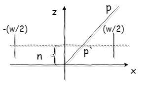
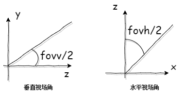

# 投影变换矩阵推导

---

​	该变换的过程是将空间中的点投影到某个指定的平面上——投影平面。通常这个投影平面与Z轴垂直——近平面。投影到该平面后，还需要结合视口(viewport)的像素大小，将投影点的x,y坐标变换到(-1 ~ 1)之间的标准范围(NDC)。

***以下内容基于左手坐标系***

## 求XY的变换过程

​	假定当前要投影的点为$p$，首先针对该点的$x$坐标进行投影变换。如图：

​	图中$n$是近平面的位置，$w$是视口的宽度，单位为像素。根据相似三角形原理，不难得出：
$$
\frac{p'.x}{p.x} = \frac{n}{p.z}\\
p'.x = \frac{p.x * n}{p.z}
$$
​	而此时的$p'.x$位于$-\frac{w}{2}, \frac{w}{2}$之间，需要将它映射为(-1, 1)之间。不难得出映射结果：

$$
p''.x = \frac{2*p'x}{w} \\
p''.x = \frac{2*p.x*n}{p.z * w}
$$
​	同理可得$p''.y = \frac{2 * p.y * n}{p.z * h}$，其中$h$代表视口的高度，单位为像素。

## 变换为矩阵需要的准备工作

​	然而以上的$p''.x以及p''.y$都没有办法使用矩阵的方式从$p.x以及p.y$中得到，因为当中涉及到$p.z$的除法。所以在管线中，特定预留了除法的步骤——透视除法(使用$w$分量，分别除$x,y,z$分量，得出最后变换的结果)。所以我们实际需要做的变换是将$p.x,p.y$变换为$p''.x * p.z以及p''.y * p.z$。即：
$$
p''.x * p.z = \frac{2*p.x*n}{w} \\
p''.y * p.z = \frac{2*p.y*n}{h}
$$

## 处理剩余的z分量

​	z分量在被投影到平面后仍然可以用来处理遮挡关系。和xy分量相同都需要被变换，只是z变换范围是(0,1)
$$
p''.z = 1 (p.z = f) \\
p''.z = 0 (p.z = n)
$$
​	其中，$n$表示近平面距离$f$表示远平面距离。

​	和xy分量相同的处理方式——需要乘以$p.z$。求解线性变换如下：
$$
p''.z * p.z = a * p.z + b \\
\begin{cases}
	f = a * f + b & (p''.z = 1, p.z = f)\\
	0 = a * n + b & (p''.z = 0, p.z = n)
\end{cases} \\
不难得出 \\
\begin{cases}
	a = \frac{f}{f - n} \\
	b = \frac{n*f}{n - f}
\end{cases} \\
故 \\
p''.z * p.z = \frac{f * p.z}{f - n} + \frac{n * f}{n - f}
$$

## 求得矩阵

​	以上已经求出了xyz分量的变化，而w分量就是原来的z分量。不难得出矩阵为：
$$
Proj = \left|
	\begin{matrix}
	\frac{2*n}{w} & 0 & 0 & 0 \\
	0 & \frac{2*n}{h} & 0 & 0 \\
	0 & 0 & \frac{f}{f - n} & \frac{n*f}{n - f} \\
	0 & 0 & 1 & 0
	\end{matrix}
\right|
$$

## 消掉w和h

​	目前的宽高是视口的大小，单位是像素。我们使用$n, w, h$之间的比例关系，消除这些较为绝对的变量。首先最简单的关系是窗口的宽高比$aspect = \frac{w}{h}$，其次是视场角

这里使用垂直视场角，可以得出$tan(\frac{fovv}{2}) = \frac{\frac{h}{2}}{n} = \frac{h}{2n}$，所以$cot(\frac{fovv}{2}) = \frac{2 * n}{h}$。结合$aspect$可以得出$\frac{2*n}{w} = \frac{cot(\frac{fovv}{2})}{aspect}​$。所以矩阵最终可以改写为：
$$
Proj = \left|
	\begin{matrix}
	\frac{cot(\frac{fovv}{2})}{aspect} & 0 & 0 & 0 \\
	0 & cot(\frac{fovv}{2}) & 0 & 0 \\
	0 & 0 & \frac{f}{f - n} & \frac{n*f}{n - f} \\
	0 & 0 & 1 & 0
	\end{matrix}
\right|
$$
