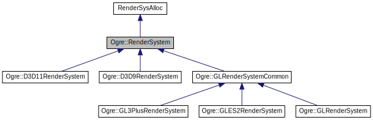

# Ogre Render System接口分析

---

> Ogre利用继承的方式，根据不同图形API实现不同版本的RenderSystem。Ogre是如何设计RenderSystem的接口，让不同类型的图形API能够以相似的方式进行工作呢？
>
> 本文不介绍具体的接口，仅从较高的视角分析有哪些类型的接口

[TOC]

## Responsibility

​	RenderSystem就是对管线的抽象，它仅创建管线所需要的基础变量，不创建任何渲染相关的资源，包括贴图，Render Target，Vertex/Index Buffer，Shader等。而是将这些资源整合到管线上，控制渲染的开始和结束。所以在RenderSystem中包含的是这些资源的引用(指针)列表。这也就意味着，不同的资源都需要有自己的抽象，才能整合到RenderSystem中。

> Overview from 10,000 feet :)

## Initialize

​	RenderSystem需要提供初始化的接口。然而RenderSystem下是许多不同图形API的实现。所以这个初始化接口不能够定的“太死”。Ogre设计的接口以std::map\<std::string, std::string\>为参数，即以字符串的形式，传入多个parameter : value对，再由不同的实现对接收到的参数进行解析，完成初始化。DX11在初始化的过程中仅创建了Device。

## RenderWindow

​	这是为数不多的，RenderSystem创建的“资源”。由于渲染窗口本身暗含了一个主要的RenderTarget——Backbuffer，而这个RenderTarget对渲染结果的展示又异常重要，所以被归类到RenderSystem身上。同样的，不同平台对于窗口的创建要求都不一样。尽管Ogre有自身负责窗口管理的类[Ogre::RenderWindow](https://ogrecave.github.io/ogre/api/latest/class_ogre_1_1_render_window.html)，但通过RenderSystem提供的接口同样需要适应不同的平台，所以和初始化套路相同，使用字符串对的形式传入参数，由不同平台解析参数后进行窗口创建。

## DepthBuffer

​	这是另外一个可以通过RenderSystem创建的资源，但这个资源需要指定一个RenderTarget，即针对某个RenderTarget为其创建DepthStencilBuffer。创建完的缓冲需要由创建的申请者(接口函数调用者)负责进行管理。

## Assembling The Pipeline

​	RenderSystem的主要职责就是管理管线，大部分的接口都是与管线设置有关。从管线的入口，到管线的输出，RenderSystem都有针对的接口。

​	比如管线的入口有最初的VertexBuffer设置，IndexBuffer设置，再者是各shader都会需要外部提供常量缓冲取或者贴图以及采样设置；再到管线的构成，RenderSystem提供设置各部分Shader的接口；再到管线的出口，有专门的接口设置RenderTarget以及DepthStencilBuffer；最后是管线的几个状态设置接口，包括光栅化的设置(顶点绕徐，点，线的粗细，剔除设置)，以及输出时的测试方式(包括深度测试，模板测试以及混合方式)。

## Finally

​	RenderSystem的关键有三：

1. 明确RenderSystem的定位——仅作为管线的“代表”，仅涉及尽可能少的资源管理行为。
2. 在明确自身定位的基础上，设计尽可能全面的接口类型(设计时候，事实上还需要考虑其它资源的抽象方式。)
3. 最后是对一些参数类型差异较大的接口进行专门设计——比如用字符串的形式传递参数，由具体实现解析参数。