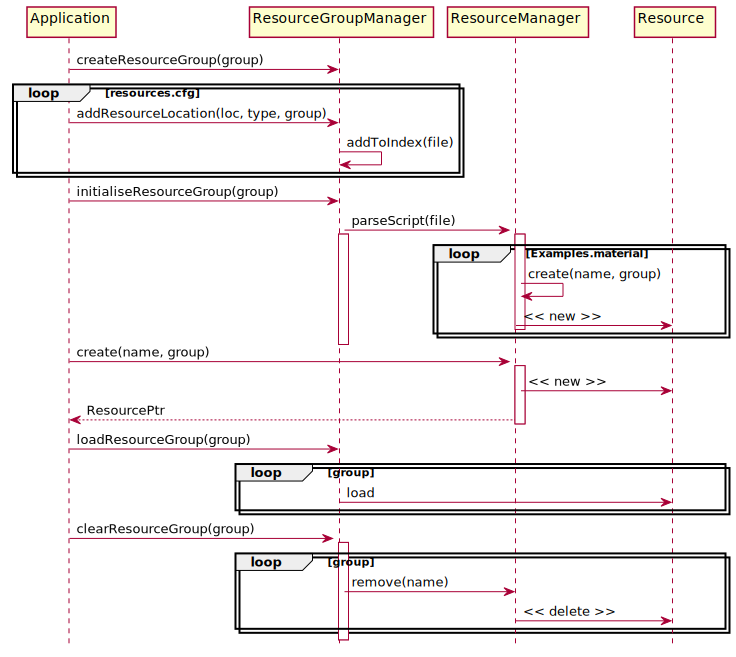

# Resource Management

---

​	资源是需要被应用加载和管理的数据对象。资源可以是[Ogre::Mesh](https://ogrecave.github.io/ogre/api/latest/class_ogre_1_1_mesh.html)，也可以是[Ogre::Texture](https://ogrecave.github.io/ogre/api/latest/class_ogre_1_1_texture.html)。资源对象必须要满足以下几个关键属性：

* 资源必须具有独立的名称
* 资源只能被加载一次
* 资源必须被高效管理，尤其是检索资源
* 资源必须能够在其不被需要时被卸载，以释放部分内存从而满足应用的内存要求。

## Resource Life-cycle

​	特定的[Ogre::ResourceManager](https://ogrecave.github.io/ogre/api/latest/class_ogre_1_1_resource_manager.html)负责通过资源池的方法管理特定类型的资源。管理器必须能够索引，查询，加载以及删除它们。同时，管理器必须进行内存管理，对加载资源所占用的内存进行必要的释放，从而控制资源占用的内存量在规定范围内。

​	资源管理器使用LRU算法，决定哪些资源需要被释放。

​	可以通过管理器的通用接口进行资源的加载，卸载以及删除。同时，为管理特定资源类型，继承自资源管理器的特定类型资源管理器，会具有自定义的加载函数以及与之相关的参数。

​	资源的创建会经历几个状态，当处在[LOADSTATE_UNLOADED](https://ogrecave.github.io/ogre/api/latest/class_ogre_1_1_resource.html#a07e619aa09d3bc6789a6667cb4fc572ca28d463296cacdfc115dbc3fb02d00e94)时，意味着资源尚未被加载，或者说只是一个空壳，之后状态转移为[LOADSTATE_PREPARED](https://ogrecave.github.io/ogre/api/latest/class_ogre_1_1_resource.html#a07e619aa09d3bc6789a6667cb4fc572ca133a073b86c346096237063f99870fc1)，这通常意味着资源创建所需要的数据已经从硬盘加载到内存中。当然，这些状态的具体含义还与资源的类型有一定关系。当资源处在[LOADSTATE_LOADED](https://ogrecave.github.io/ogre/api/latest/class_ogre_1_1_resource.html#a07e619aa09d3bc6789a6667cb4fc572caa38cbef7605fc4bff6da2f34599ace8f)时，意味着资源已经加载完毕，能够被送入GPU中利用。

​	所有资源自身都具有加载和卸载接口，但删除资源只能通过[Ogre::ResourceManager](https://ogrecave.github.io/ogre/api/latest/class_ogre_1_1_resource_manager.html)进行。

## Locations

​	资源必须要从特定的路径加载，通过调用[Ogre::ResourceGroupManager::addResourceLocation](https://ogrecave.github.io/ogre/api/latest/class_ogre_1_1_resource_group_manager.html#a6ff0efec5d27cedb448cfba8b2b78c8d)可以添加资源加载路径列表。最先设置的路径会被优先选择。

​	路径可以是本地的磁盘路径，也可以是某个压缩文件中的内部路径，甚至是网络文件。可以利用插件的方式，通过实现[Ogre::Archive](https://ogrecave.github.io/ogre/api/latest/class_ogre_1_1_archive.html)类(抽象类，可以理解为文件的容器。比如某个磁盘路径，则这个容器里就包含了该路径下的所有文件)，从而提供不同的路径类型。

## Groups

​	资源路径是以组的方式被组织的。而一组资源就是一系列能够被同时加载和卸载的资源的集合。属于一个组的资源能够在相似的路径下被加载。有以下几个预先定义的组

* General，这个组中的资源在应用开启时被加载，在应用关闭时被卸载

* INTERNAL_RESOURCE_GROUP_NAME，这是Ogre内部使用的资源组，用户不应该接触

* AUTODETECT_RESOURCE_GROUP_NAME，其实这个不能算是一个组，而应该说，当资源的组别被设置为这个值时，就意味着用户希望Ogre在已有的所有组中，寻找与资源名称相同的资源，这个名称相同的资源所在的组，就是这个值当时实际代表的值。

  用户可以创建自定义的组，一个组中的资源可以通过两种方式进行创建：

  1. 通过脚本的方式进行创建
  2. 通过[Ogre::ResourceManager::createResource](https://ogrecave.github.io/ogre/api/latest/class_ogre_1_1_resource_manager.html#a700088a63eabb0f6cb1fac96686db464)进行创建。

  在创建完自定义的组后，需要设置资源的加载路径，并调用[Ogre::ResourceGroupManager::initialiseResourceGroup](https://ogrecave.github.io/ogre/api/latest/class_ogre_1_1_resource_group_manager.html#af5c901bfb116d7f70f4542bd828784f4)进行初始化。资源将会在被使用时从路径中被加载进内存，并生成完整的资源供使用。