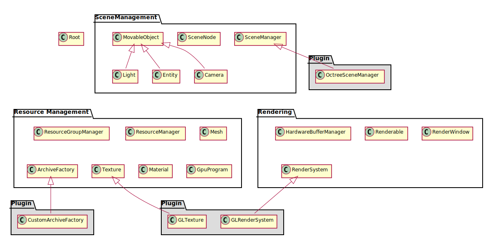

# 翻译：The Core Objects

---

Origin [FILE](https://ogrecave.github.io/ogre/api/latest/_the-_core-_objects.html)

​	文章将会对Ogre内，经常被使用的，核心的对象进行简要概述。

## A Word About Namespaces

​	Ogre使用c++命名空间，将所有的类，枚举，结构等内容都放在同一个命名空间Ogre中，从而避免命名冲突，比如[Ogre::Camera](https://ogrecave.github.io/ogre/api/latest/class_ogre_1_1_camera.html)，[Ogre::Vector3](https://ogrecave.github.io/ogre/api/latest/namespace_ogre.html#ac94fc4008c1165dea017263fee56b273)。请保证所使用的编译器支持这一特性。

## 从一万英尺外看Ogre

​	下图展示的是Ogre中最最重要的几个类，它们分布在Ogre的哪些模块中，它们是如何联系到一起的。

​	在图的最上方是Root对象，该对象用来创建其它“高级”的对象，比如场景管理器，渲染系统，渲染窗口，加载插件以及其它基本内容。Root对象是用户使用Ogre的入口，假如你不知道某个功能怎么实现，先从Root开始研究。Root会为你创建一些能够实现你需要功能的对象，它就是Ogre系统的组织者。

​	Ogre的所有类可以分为3类，每一类都代表一系列密切相关的功能：

### Scene Management

​	场景管理包括所有涉及到场景的功能，比如场景是怎么组织的，从哪个角度观察这个场景等等。场景管理相关的类会为你提供用来描述场景的，更加自然的接口。比如，你不需要告诉Ogre“设置这几个渲染状态，然后渲染这几个集合体”，相反，通过接口，你可以用近似“在这里放几个模型，把摄像机放到那里，从那个摄像机拍摄场景”的方式，向Ogre描述你的场景。剩下的渲染就交给Ogre完成。

### Resource Management

​	所有的渲染活动都需要资源，包括几何体，贴图，字体等。合理地加载，重用，卸载这些资源非常重要。资源管理相关的类就是负责完成这些工作。

### Rendering

​	最后是渲染相关的类，这些类通常涉及到底层的渲染API及其对象，包括缓存，渲染状态等一系列与管线相关的内容。场景管理中的类需要依赖渲染相关的类，从而将场景中的内容呈现在屏幕上。

​	你可能注意到，在三个大领域外有多个Plugin。事实上，Ogre就是被设计为高扩展性的库，而高效地支持插件正是这一特性的表现。Ogre很多类都可以通过继承的方式得到扩展。比如通过继承场景管理器，从而修改场景的组织方式；通过继承渲染系统，从而使用不同的渲染API完成渲染过程；甚至可以通过继承的方式扩大Ogre支持的文件类型。除此之外，Ogre可以支持非常多的插件(只要愿意开发)，这使得Ogre可以轻松地嵌入或者嵌入到其它应用当中，从而扩展出你希望的应用。

## Root对象

​	[Ogre::Root](https://ogrecave.github.io/ogre/api/latest/class_ogre_1_1_root.html)对象是Ogre的入口，这个对象必须是第一个创建，最后一个销毁的。

​	Root对象可以帮助你配置系统。比如使用函数[Ogre::Root::showConfigDialog](https://ogrecave.github.io/ogre/api/latest/class_ogre_1_1_root.html#aedc76ef3bdc6514bd4655be0d70d6bcd)就可以非常简单地完成分析所有渲染系统的支持情况，展示渲染系统配置窗口的功能。同时，该函数还能够记录用户修改过的设置，并应用在后续的初始化过程中。

​	Root对象也负责向用户提供其它子系统的指针。比如[Ogre::SceneManager](https://ogrecave.github.io/ogre/api/latest/class_ogre_1_1_scene_manager.html)，[Ogre::RenderSystem](https://ogrecave.github.io/ogre/api/latest/class_ogre_1_1_render_system.html)等。

​	最后，你可能希望Ogre能够连续渲染你设置的场景，从而展示出动态的效果。Root对象提供了[Ogre::Root::startRendering](https://ogrecave.github.io/ogre/api/latest/class_ogre_1_1_root.html#a8eda253befda1255cbfd3b298f62449e)方法，能够让Ogre进入渲染循环当中，当且仅当展示渲染结果的窗口被关闭，或者[Ogre::FrameListener](https://ogrecave.github.io/ogre/api/latest/class_ogre_1_1_frame_listener.html)对象发出终止渲染循环的消息，渲染循环才退出。

## 渲染系统对象(The RenderSystem object)

​	[Ogre::RenderSystem](https://ogrecave.github.io/ogre/api/latest/class_ogre_1_1_render_system.html)对象是一个纯虚的类，它定义许多渲染系统通用的接口(功能)，这些内容必须要由具体图形API进行实现，从而构成一个与特定图形API相关的渲染系统对象，比如DX11，OpenGL。Ogre其它组件通过调用渲染系统的通用接口，向具体的图形API发送渲染操作以及设置渲染管线的状态。当调用[Ogre::Root::initialise](https://ogrecave.github.io/ogre/api/latest/class_ogre_1_1_root.html#a6ab8f204bbfb150ad180eb6e78e4639c)后，由指定图形API实现的RenderSystem子类(比如D3D11RenderSystem)就被初始化完成，可以通过[Ogre::Root::getRenderSystem()](https://ogrecave.github.io/ogre/api/latest/class_ogre_1_1_root.html#ab8ca3d5abebba7a14650db5f618286d0)方法获得RenderSystem父类指针。

​	一般而言，用户不需要直接调用或者设置RenderSystem，所有与渲染相关的操作都可以通过[Ogre::SceneManager](https://ogrecave.github.io/ogre/api/latest/class_ogre_1_1_scene_manager.html)，材质以及其它与场景相关的对象，以更加自然(更加贴近人的表达)的方式实现。只有当你需要创建多个独立的渲染窗口或者其它更加高级的渲染操作时，才需要考虑直接使用RenderSystem。

​	因此，下文将不再详细描述RenderSystem。你可以放心地将渲染操作交给SceneManager帮你完成。

## The SceneManager Object

​	从应用开发地角度来说，场景管理对象可能是除了根对象外，第二重要的对象。场景管理在应用开发过程中会经常使用到。它负责对与渲染相关的场景内容进行管理，这些内容可能是摄像机，光源，可动的或者不可动的几何体等等。你可以通过getCamera，getLight，getEntity等方法，轻松地获得这些被管理的对象。

​	通常来说，我们不需要手动调用[Ogre::SceneManager::_renderScene](https://ogrecave.github.io/ogre/api/latest/class_ogre_1_1_scene_manager.html#a29ba8a2cad151d307d04781f749e7e84)来要求进行渲染。相反，SceneManager会在检测到有渲染对象发生变更时，自动调用这个函数完成画面的更新。

​	所以，我们只需要确保在渲染开始前，通过调用SceneManager提供的方法设置好场景即可。当然，你也可以考虑利用监听者模式，在某些特殊事件被触发时修改场景的设置。

​	由于不同应用可能会有不同的场景类型(比如大型开发场景，小型的封闭场景)，你可以通过继承SceneManager，为你所关心的场景类型提供更优的管理和组织方法(千万不要指望默认的实现可以在大场景中提供多少性能)。比如对于封闭环境就可以使用BspSceneManager，这是利用BSP场景分割算法实现的场景管理器。用户也可以在不同场景之间切换场景管理对象，进而为应用中不同类型的场景提供最优的场景管理方法。

​	在使用Ogre时，我们不必知道哪些类型的场景管理器可用，因为[Ogre::Root::createSceneManager()](https://ogrecave.github.io/ogre/api/latest/class_ogre_1_1_root.html#a8bb8655f823a98007775f69278c1b0f9)方法会为我们选择适合我们场景类型的，可用的场景管理器。我们需要做的只是传入我们使用的场景类型作为参数即可(比如[Ogre::ST_GENERIC](https://ogrecave.github.io/ogre/api/latest/group___scene.html#gga7383602bd480d43b80c626969b9af914a0af8f844019e52fe112e9a946a919fcd)，[Ogre::ST_INTERIOR](https://ogrecave.github.io/ogre/api/latest/group___scene.html#gga7383602bd480d43b80c626969b9af914a93f2170ad3a8132f29264dc3642a2dcf))。这样做的好处是可以在不修改用户代码的前提下，通过更改Ogre自身的代码，持续为不同类型的场景提供最优的场景管理方法。

## The ResourceGroupManager Object

​	你可以将[Ogre::ResourceGroupManager](https://ogrecave.github.io/ogre/api/latest/class_ogre_1_1_resource_group_manager.html)理解为是装载可重用资源的仓库，比如贴图，模型等。你可以利用这个管理器定义一组资源，从而方便对这些资源进行统一的加载和卸载。当然，支撑起它这些功能的，是不同类型资源的管理器，比如[Ogre::TextureManager](https://ogrecave.github.io/ogre/api/latest/class_ogre_1_1_texture_manager.html)，[Ogre::MeshManager](https://ogrecave.github.io/ogre/api/latest/class_ogre_1_1_mesh_manager.html)。

​	资源管理器负责保证资源仅被加载一次，而且可以在引擎的各个部分共用。同时，这些资源管理器还需要维护自己资源所占用的内存空间。资源管理设置有自己的资源加载路径，这些路径不一定是本地的磁盘路径，也可以是其它压缩文件内的路径，或者网络路径。

​	通常来说，我们不需要直接接触到各个资源管理器。Ogre会在我们发出申请后，自动地调用相关的资源管理器在合适的时候完成资源的加载或者卸载。我们需要做的只是通过[Ogre::ResourceGroupManager::addResourceLocation](https://ogrecave.github.io/ogre/api/latest/class_ogre_1_1_resource_group_manager.html#a6ff0efec5d27cedb448cfba8b2b78c8d)方法，告诉资源管理器我们需要加载的资源路径是什么。

## The Mesh Object

​	一个[Ogre::Mesh](https://ogrecave.github.io/ogre/api/latest/class_ogre_1_1_mesh.html)对象代表了一些列相关的三维模型，这些模型可以带有动画，同时会在场景中移动。Mesh对象本身是一种资源，通过MeshManager进行创建和加载。Mesh对象是Entity对象的基础。

## Entities

​	一个实体代表了一个场景中可移动的物体，这个物体可以是一个人，一辆车。总之，这个实体在场景中没有一个固定的位置。

​	实体必须基于Mesh对象。多个实体之间可以共用相同的Mesh对象。

​	你可以通过调用[Ogre::SceneManager::createEntity](https://ogrecave.github.io/ogre/api/latest/class_ogre_1_1_scene_manager.html#afb393cca49de8b928f7dd60838047185)方法创建一个实体，你需要提供的是实体的名称以及实体所依赖的Mesh的名称。尔后，SceneManager可以通过调用MeshManager，保证将Mesh加载进来。

​	只有当实体挂接到[Ogre::SceneNode](https://ogrecave.github.io/ogre/api/latest/class_ogre_1_1_scene_node.html)上时，才能算是加入到场景中。你可以通过这个方式创建复杂的，分层次的场景。同时，通过修改节点的位置和朝向，间接修改其子节点下的实体的位置和朝向。

​	当一个Mesh对象被加载时，其附带的材质也会被加载进来作为这个Mesh对象的默认材质。实体之间可以共享同样的Mesh对象，但同时每个实体之间的材质保持差异。这是通过Mesh和Entity的子结构实现的。一个Mesh下会有多个[Ogre::SubMesh](https://ogrecave.github.io/ogre/api/latest/class_ogre_1_1_sub_mesh.html)，每个SubMesh代表了一个Mesh下使用相同材质的一组网格。而Entity下则拥有[SubEntity](https://ogrecave.github.io/ogre/api/latest/class_ogre_1_1_sub_entity.html)。Entity与Mesh对应，同样，SubEntity与SubMesh对应。可以通过修改SubEntity的材质，进而替换其对应的SubMesh的材质，最终实现不同Entity之间的材质差异。

## Materials

​	[Ogre::Material](https://ogrecave.github.io/ogre/api/latest/class_ogre_1_1_material.html)对象负责控制一个对象的渲染效果。它内部设置了许多与物体表面效果相关的属性，比如反射的颜色，反光程度等，另外还有一些与渲染算法相关的设置，比如使用了多少层贴图，贴图内容是什么，多个贴图内容之间如何混合，环境贴图如何映射到表面，裁剪方式等等。

​	材质可以在应用中创建，也可以利用外部的脚本设置创建过程。

​	物体除了其自身几何体形状是由网格决定意外，其余外观表现均由材质决定。

​	Ogre中的材质是由[Ogre::MaterialManager](https://ogrecave.github.io/ogre/api/latest/class_ogre_1_1_material_manager.html)进行管理的。其包含了一个列表，记录了可以被应用到场景物体身上的材质。可以使用[Ogre::MaterialManager::create](https://ogrecave.github.io/ogre/api/latest/class_ogre_1_1_material_manager.html#a3068599a5b10421e6203d568006f5f93)向列表中增加材质。

​	实体默认的材质是与其绑定的Mesh对象的默认材质。前文已经提到这个材质可以被更改。