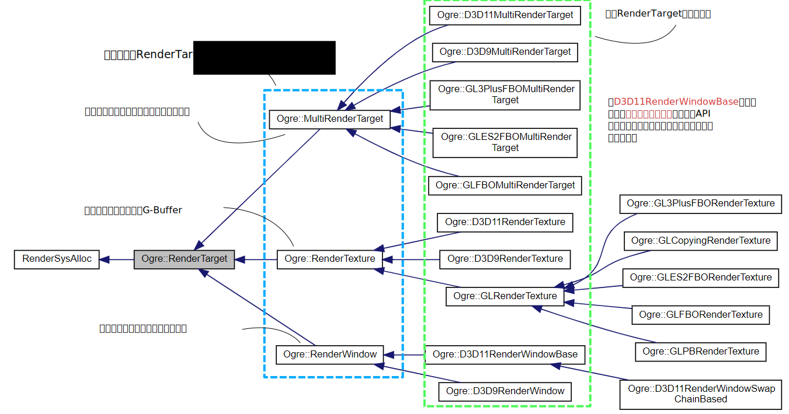

# OGRE RenderSystem的关键概念

---

## SceneManager

## RenderSystem

RenderSystem作为所有RenderSystem Subclass的父类，维护渲染管线的状态，包括顶点绕序，是否开启深度测试，是否进行模板测试，是否需要alpha混合，哪种shader当前被绑定了等。

同时还包括一些记录各shader参数集合的对象指针，renderTarget的指针，而这些指针都是指向虚基类的。

渲染系统的入口：`virtual void _render(const RenderOperation& op);`

*该函数从当前激活viewport所关联的camera进行渲染，将渲染结果记录到viewport所关联的renderTarget上*

### DX11RenderSystem::_render 基本步骤

1. 获得[顶点缓冲](#jump_HardwareVertexBuffer)以及顶点结构描述
2. 调用基类RenderSystem，更新一次渲染的基本参数，包括渲染的顶点数量，面数量。
3. 根据渲染管线的状态：混合模式，光栅方式，模板测试方式，贴图采样方式是否发生变化，重新设置这些对象属性。
4. 检查哪些shader需要被绑定，将这些shader设置到管线上
5. 最后根据选择的图元类型以及图元数量，选择合适的draw方法

### 获得顶点缓冲以及顶点结构描述

#### 1. 顶点缓冲从哪里来

顶点缓冲是通过RenderSystem的`setGlobalInstanceVertexBuffer`设置的，但该函数被哪个对象调用，暂时不得而知。

#### 2. 顶点缓冲都有什么

通过对HardwareVertexBuffer以及HardwareBuffer的分析可知，这些基类当中都没有存储实际的缓存数据。HardwareBuffer仅存储了缓冲区的**大小信息**，而HardwareVertexBuffer仅在HardwareBuffer的基础上，增加了顶点缓存特定的描述信息，包括一个**顶点的字节大小**，以及**顶点的数量**。

实际的缓存内容由于与具体的API相关，所以被**单独放在了各个API的实现**当中。以DX11为例，DX11由于有统一的缓冲区申请和管理方法，所以D3D11HardwareBuffer存储着实际缓存对象指针——ID3D11Buffer。而D3D11HardwareVertexBuffer只是D3D11HardwareBuffer的一个“外壳”，为那些需要使用HardwareVertexBuffer抽象基类的函数提供方便。

*对VertexBuffer的分析详尽下文*

### 调用基类RenderSystem，更新一次渲染的基本参数，包括渲染的顶点数量，面数量。

由于RenderSystem作为父类，并没有提供多少实质性的功能，只是负责对管线上的通用属性进行维护记录。所以在DX11RenderSystem当中会调用父类的_render方法进行状态更新。

## HardwareVertexBuffer

### 1. 谁负责创建

### 2. 谁负责提供数据

// TODO

## RenderOperation

## GPUProgram

## RenderTarget

这是一个抽象基类，可以理解为对一切可**承载渲染结果**的对象的抽象。

可以肯定的是这个类负责创建**viewport**，一个RenderTarget能够同时拥有**多个**viewport。一个viewport与一个camera联系，决定了通过这个camera渲染的结果会被保存在由viewport指定的renderTarget的局部/全部区域。

camera，viewport，RenderTarget三者之间的关系：

RenderTarget同时还拥有DepthBuffer，不过该缓存作为索引的形式存在，估计是有Buffer Manager，利用索引获得DepthBuffer。至于DepthBuffer对RenderTarget的作用，毋庸置疑是对渲染结果进行深度检测。

## RenderQueue