# OGRE RenderSystem的关键概念

---

[<- back to index](../index.md)

## SceneManager


## RenderSystem

RenderSystem作为所有RenderSystem Subclass的父类，维护渲染管线的状态，包括顶点绕序，是否开启深度测试，是否进行模板测试，是否需要alpha混合，哪种shader当前被绑定了等。

同时还包括一些记录各shader参数集合的对象指针，renderTarget的指针，而这些指针都是指向虚基类的。

<font color="red">RenderSystem的启动函数：</font>`virtual void _render(const RenderOperation& op);`

*该函数从当前激活viewport所关联的camera进行渲染，将渲染结果记录到viewport所关联的renderTarget上*

**函数参数op**记录了这次渲染过程中用到的顶点数据，具体看[RenderOperation](#RenderOperation)

### DX11RenderSystem::_render 基本步骤

1. 获得[顶点缓冲](#HardwareVertexBuffer)以及顶点结构描述
2. 调用基类RenderSystem，更新一次渲染的基本参数，包括渲染的顶点数量，面数量。
3. 根据渲染管线的状态：混合模式，光栅方式，模板测试方式，贴图采样方式是否发生变化，重新设置这些对象属性。
4. 检查哪些shader需要被绑定，将这些shader设置到管线上
5. 最后根据选择的图元类型以及图元数量，选择合适的**管线启动**方法

### 获得顶点缓冲以及顶点结构描述

#### 1. 顶点缓冲从哪里来

顶点缓冲是通过RenderSystem的`setGlobalInstanceVertexBuffer`设置的，但该函数被哪个对象调用，暂时不得而知。

#### 2. 顶点缓冲都有什么

通过对HardwareVertexBuffer以及HardwareBuffer的分析可知，这些基类当中都没有存储实际的缓存数据。HardwareBuffer仅存储了缓冲区的**大小信息**，而HardwareVertexBuffer仅在HardwareBuffer的基础上，增加了顶点缓存特定的描述信息，包括一个**顶点的字节大小**，以及**顶点的数量**。

实际的缓存内容由于与具体的API相关，所以被**单独放在了各个API的实现**当中。以DX11为例，DX11由于有统一的缓冲区申请和管理方法，所以D3D11HardwareBuffer存储着实际缓存对象指针——ID3D11Buffer。而D3D11HardwareVertexBuffer只是D3D11HardwareBuffer的一个“外壳”，为那些需要使用HardwareVertexBuffer抽象基类的函数提供方便。

*对VertexBuffer的分析详尽下文*

### 调用基类RenderSystem，更新一次渲染的基本参数，包括渲染的顶点数量，面数量。

由于RenderSystem作为父类，并没有提供多少实质性的功能，只是负责对管线上的通用属性进行维护记录。所以在DX11RenderSystem当中会调用父类的_render方法进行状态更新。

#### 3. 根据渲染管线的状态：混合模式，光栅方式，模板测试方式，贴图采样方式是否发生变化，重新设置这些对象属性。

这是对DX11RenderSystem实现的一些评论：

​	混合模式是可以对8个RenderTarget(这里指DX11API概念的RenderTarget)进行分别设置，但Ogre的实现只针对第一个(RenderTarget[0])进行了设置；

​	贴图采样被局限为8个——是所有shader*共用*8个贴图。这可能就是Ogre支持多种API引入的局限吧；

#### 4. 检查哪些shader需要被绑定，将这些shader设置到管线上

​	根据shader的指针是否指向非空(!= null)位置判断该shader是否需要被绑定到管线上。

#### 5. 最后根据选择的图元类型以及图元数量，选择合适的管线启动方法

​	之所以成为管线启动方法，是因为当绑定了compute shader后是不会进行任何draw，而是类似cuda的启动多个gpu 线程执行compute shader指令。

​	而当绑定的是非compute shader时，即启动的是传统管线。此时分两步走。首先是确定当前draw call需要绘制的顶点数量，以及绘制的图元。之后再根据是否使用Instance技术以及index，选择不同的draw命令。

​	DX11实现中，会根据是否使用了tessellation shader确定不同的顶点数量以及图元类型。由于尚未接触过tessellation shader，此处暂不详细分析。其次，选择draw命令之前，会根据是否使用index，决定是否需要绑定index buffer。再确定使用的是`DrawIndexed`(仅index)，`DrawIndexedInstanced`(index && instance)，`DrawInstanced`(仅instance)还是`Draw`​(!index && !instance)

<font color="green">TODO: </font>	draw命令似乎是一个循环，会根据GPU Parameter决定迭代的次数，需要分析GPU Parameter是什么

### 那shader的参数呢？

​	shader的参数创建与设置与GpuProgram和GpuProgramParameter有关。

## HardwareVertexBuffer
### 1. 谁负责创建

### 2. 谁负责提供数据

<font color="green">TODO:</font>

## RenderOperation

这是一个简单类，用于记录一个Renderable(可渲染对象)的一次渲染操作所需要的特定数据。

数据包括：

* 图元类型(操作类型)

* 顶点数据([VertexData](#VertexData)\*)

  ​	虽然叫VertexData，但实际上并不是存储顶点数据(顶点数据在具体实现相关的XXXHardwareVertexBuffer中)，而是**顶点缓冲声明**以及**顶点绑定情况**(还有其它零散的数据如顶点动画)。

  ​	顶点绑定情况是指不同顶点缓冲应该绑定到哪个slot上，这是与API相关。比如DX就有这个概念，可以想象“渲染管道入口”有八个(八个slot)，每个slot都可以接上一个顶点缓冲，所以就需要指定每个顶点缓冲应该接到哪个slot上。这个技术的意义在于，一个顶点的数据可以被拆分到多个顶点缓冲中，比如一次绘制需要绘制3个顶点，A缓冲存储3个顶点的位置信息，B缓冲按照同样顺序存储3个顶点的法线信息，C缓冲按照相同顺序存储3个顶点的UV信息。到顶点缓冲就可以从三个缓冲中分别获取顶点数据，构成一个完整的顶点信息。一言以蔽之——扩大了顶点缓冲的定义。

  ​	顶点缓冲声明是指不同的顶点缓冲中存储的顶点数据是怎样的。比如声明中可能有一项是指slot 0上绑定的缓冲区记录了顶点的uv坐标。

* 索引数据(IndexData\*)

  ​	IndexData对象中仅包含一个HardwareIndexBuffer，同HardwareVertexBuffer一样，实际的索引数据存储在与具体实现相关的XXXHardwareIndexBuffer中。

  ​	当这次的渲染操作指定使用索引时，这个指向IndexData的指针数据成员必须非空(!=null)。

* 其它数据成员

  * numberOfInstance

    ​	Instance技术为的是重复利用同一套顶点数据进行绘制。比如模型相同的树，就可以传入一颗树的顶点数据，并说明使用Instance技术即可利用一颗树的顶点信息，绘制多颗相同的树，减少顶点数据的传入数量。

  * useGlobalInstancingVertexBufferIsAvailable

    <font color="green">TODO:</font> 上面的`numberOfInstance`是局部的Instance数量，而这个参数似乎是全局的Instance

  * srcRenderable

    ​	根据文档描述，是用于调试使用的成员变量。该变量指向的是创建该`RenderOperation`的对象。尚不清楚调试过程是怎样的。

## VertexData

​	一个包含顶点缓冲声明以及顶点缓冲绑定情况的信息结构。可以这样理解：


​	无论是VertexDeclaration还是VertexBufferBinding都只是描述信息而已。*这里假设pipeline只有4个slot，实际数量与API有关*。

​	由图不难理解VertexDeclaration描述的是某个顶点属性在哪个缓冲中，缓冲是利用与之绑定的slot指定的；起始位置与缓冲区起始位置相差多少个字节；至于索引，是和API语义相关的，最常用在贴图属性上。一个顶点可能有两套UV，此时就会有属性UV0和UV1，0和1就是通过索引指定的。

​	至于VertexBufferBinding就更容易理解了，是HardwareVertexBuffer与slot之间的绑定关系。

## GPUProgram

#### 1. 资源”创建“过程

​	创建之所以被打上双引号，是因为Ogre的资源创建与加载过程是分开的。这里的创建只是创建了一个资源的”空盒“实际与API相关的成员变量需要加载后才生成。以下是创建的过程(以DX11为例)：



#### 2. Shader的加载

<font color="green">TODO</font>

## GPUProgramParameter

​	Shader的参数必须由shader创建，但可在多个shader之间共享。

## RenderTarget

这是一个抽象基类，可以理解为对一切可**承载渲染结果**的对象的抽象。


可以肯定的是这个类负责创建**viewport**，一个RenderTarget能够同时拥有**多个**viewport。一个viewport与一个camera联系，决定了通过这个camera渲染的结果会被保存在由viewport指定的renderTarget的局部/全部区域。

camera，viewport，RenderTarget三者之间的关系：


RenderTarget同时还拥有DepthBuffer，不过该缓存作为索引的形式存在，估计是有Buffer Manager，利用索引获得DepthBuffer。至于DepthBuffer对RenderTarget的作用，毋庸置疑是对渲染结果进行深度检测。

## RenderQueue

---

## Others <font color="4466ee">有趣的实现</font>

### 参数映射

​	Ogre自身定义了一系列属性，比如``CULL_MODE`，这个属性控制了顶点绕序是顺时针还是逆时针。不同API当然会给出不同类型的枚举(名称)，但Ogre统一了这些名称：`CULL_NONE`(使用API默认绕序)，`CULL_CLOCKWISE`，`CULL_ANTICLOCKWISE`。

​	具体实现，比如DX11，当然不会和Ogre一样。DX11的实现给出了一系列重载的`get`函数，将这些枚举值转换为DX11需要的。集中在一个类中的一系列重载的静态get函数清晰地展示了Ogre与API的转换关系，清晰，易管理。

### 单例(Singleton)

​	Ogre使用模板继承的方式创建单例类。假如我希望类SClass是单例，则可以这样写：

`class SClass : public Singleton<SClass>`

​	我们来看一下`Singleton`的源代码

```c++
template <typename T> class Singleton
    {
    private:
    	// 这样一来Singleton<T>类的对象就不可以被拷贝或者赋值
    	// 当然被继承的子类自然也不能被拷贝或者赋值了
        Singleton(const Singleton<T> &);
        Singleton& operator=(const Singleton<T> &);
    
    protected:
    	// 这是Singleton<T>类的静态变量，意味着Singleton<T>名称空间下有且仅有
    	// 一个指向T类对象的指针。这是实现单例的关键
        static T* msSingleton;

    public:
        Singleton( void )
        {
            // 这个构造函数很有意思。
            // 首先static_cast< T* >(this)的this指向谁？
            // 别忘了Singleton<T>是被继承的父类，this指向的当然是T对象，
            // 或者更准确地说是T对象当前所在的内存区域(不敢断言对象是否被初始化)
            
            // 这样一来msSingleton就一定非空，下次T的构造函数被调用时，就会又一次触发
            // Singleton<T>的构造函数，此时!msSingleton自然会返回false，触发Assert，进而阻止对象创建
            OgreAssert( !msSingleton, "There can be only one singleton" );
            msSingleton = static_cast< T* >( this );
        }
    	// 析构过程不需要delete msSingleton了
    	// T对象有两种存在位置，栈或者堆
    	// 栈上的T对象不用我们回收
    	// 堆上的T对象释放由创建者管理，即谁new谁delete，单例模板本身不进行释放，避免出现多次释放
    
    	// T对象继承了Singleton，所以只要保证T对象的析构函数被调用，则Singleton的析构函数就一定会执行
        ~Singleton( void )
            {  assert( msSingleton );  msSingleton = 0;  }
    	// 以下函数就不难理解了
        static T& getSingleton( void )
        {   assert( msSingleton );  return ( *msSingleton ); }
        static T* getSingletonPtr( void )
        { return msSingleton; }
    };
}
```

​	这种单例方法的一个好处是，单例本身可以在运行时被销毁，尔后再创建一个新的单例。*暂时不敢保证这是否线程安全。*另外一个好处是，我们可以在不修改T类的构造，析构，赋值等函数基础上，直接将其变成单例。

​	使用的方式也很容易`Singleton<T>::getSingleton() / Singleton<T>::getSingletonPtr()`

### 返回对象以及创建结果

​	当某个函数功能是创建某个对象时，函数调用者可能需要查询是否创建成功。这种令函数返回多个变量的技巧有很多(Ogre的操作是我之前没见过的。)

```c++
std::pair<Object, bool> functionResult;
```

​	这样写就很明显了。

### Impl——将实现放在子类中

​	Ogre为了能够维护更加专一的接口，将共用代码放在父类，降低维护的成本，设置了许多impl的函数。在阅读代码的过程中发现许多诸如`XXXImpl()`的函数。impl当然是指implementation的意思。这些函数通常都会有对应的`XXX`函数存在。这样做的好处是将共用代码和特例实现代码分开。

​	比如资源创建，ResourceManager包含createResource函数。这个函数不是虚函数，所以其子类一般不会覆盖这个函数。这个函数内部实际上只包含了一些log调用而已，其核心是对createImpl函数的调用。而这个createImpl函数则是一个纯虚函数，意味着子类必须提供特例实现。如此一来，与具体资源相关的创建代码就可以交由具体的manager实现，而共用的代码则留在了ResourceManager父类中。

​	*Ogre代码对继承，函数覆盖，虚函数使用很有技巧，需要分辨之间的关系！*