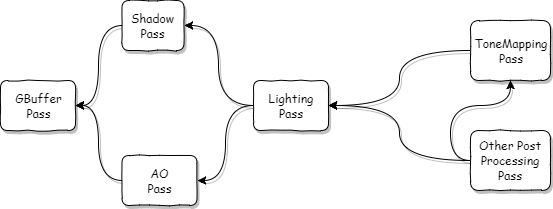

# Frame Graph理解

---

## 为什么会产生Frame Graph

​	当前最新的图形API，DX12，Vulkan给应用开发者提供了更加灵活的任务提交方式，多线程，内存管理方式。同时也要求开发者保证内存的正确分配与使用，完成CPU和GPU同步等。过去的设计没有办法清晰地完成这些工作(比如过去的资源内存管理基本由驱动完成，用户没有如今这么大的权限进行设置，在内存管理上并不需要如今考虑那么多)。

## 什么是Frame Graph

​	Frame Graph可以理解成是一张图，图中记录了完成一帧渲染所需要经过的数个处理(Pass)过程及其依赖关系，如上图所示(具体依赖关系可能存在问题，仅作概念说明使用)。制作这种图，或者说将帧渲染过程细分到这么多pass的好处是方便分析任务的依赖关系，前后关系，进而更好地完成任务并行，资源内存管理，资源声明周期管理，同步等。

### pass

​	在处理Frame Graph时，我们暂且不讨论pass内的具体执行过程，单纯想象为一个函数，并关注其输入与输出。一帧最终由多个这样的函数“顺序”执行后生成。pass之间的依赖关系基本由它们的输入输出决定，比如AO pass需要GBuffer的深度缓冲，所以AO pass依赖GBuffer pass。而Lighting Pass需要AO pass的阴影纹理作为参考，所以Lighting pass依赖AO pass。

### 同步(Fence/Parallel Execution)

​	当我们设置好每个pass的输入输出后，通过分析每个pass就可以生成它们的依赖关系(执行顺序)，生成基本的Frame Graph，并自动在各个pass中设置合理的同步资源。

### 生命周期

​	知道每个pass的执行顺序，就可以获得每个资源在帧执行过程中的声明周期。有的资源可能仅在两个相邻的pass间使用，比如AO pass和Lighting pass的阴影纹理，而有些资源可能需要长期存在。

### 内存管理(Memory allocation)

​	为不同生命周期的资源使用不同类型的内存，可以有效提减少内存的占用，提高内存的复用率。这也是新图形API所特有的功能。比如仍然是AO和Lighting的阴影纹理，在光照处理结束后，该纹理的内存区域又可以交给其它后处理过程作为Render Target。

### 资源状态(barrier)

​	根据Frame Graph的输入输出，可以清晰地知道资源的状态的变更，从而确保状态变更指令仅在实际需要时产生。过去的API资源状态由驱动负责，往往产生冗余的资源状态变更指令以及等待状态变更，降低GPU性能(确保指令正确执行)。