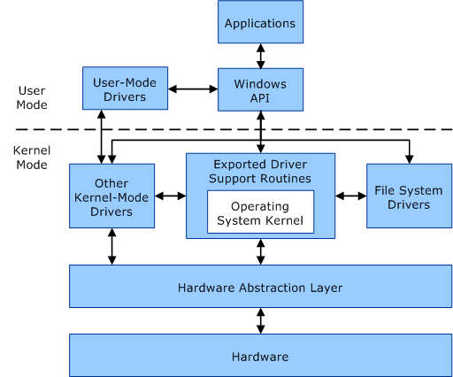

# 关于Windows下的内核态与用户态

---

先看关系图

​	首先，内核态或是用户态由当前运行在CPU上的指令决定。若当前指令是操作系统内核的指令，自然，当前CPU处在内核太；反之，当前指令是用户应用指令，则当前CPU处在用户态。区分用户态和内核态的其中一个目的是保护操作系统的执行，不容易受到其它应用的干扰。

​	**用户态**下的应用拥有自己的虚拟内存地址空间。各个应用的虚拟地址空间在逻辑上是独立的，各个应用无权访问其它应用的内存数据。当一个应用出现异常而关闭时，其它应用在理论上不受任何影响。在虚拟内存地址空间中，有一片区域是操作系统保留的，一旦用户应用访问这篇地址空间，就意味着应用可能对操作系统造成破坏，应用会被操作系统关闭。

​	**内核态**下只有与操作系统密切相关的应用，这些应用**共用**一片虚拟地址空间。运行在内核态的应用可以访问操作系统的内存地址。一旦内核态下任意应用发生异常，操作系统也会受到影响而出错。

​	上图描述的是**驱动**程序的两个状态。驱动程序既有用户态也有内核态。应用可以通过访问用户态下的驱动或者WINAPI调用内核态下驱动提供的功能。将驱动分出用户态，可以在一定程度上将驱动关键逻辑保护起来，保护操作系统的安全运行，同时给用户提供稳定安全的接口访问设备。

### 参考

[User mode and kernel mode](https://docs.microsoft.com/en-us/windows-hardware/drivers/gettingstarted/user-mode-and-kernel-mode)